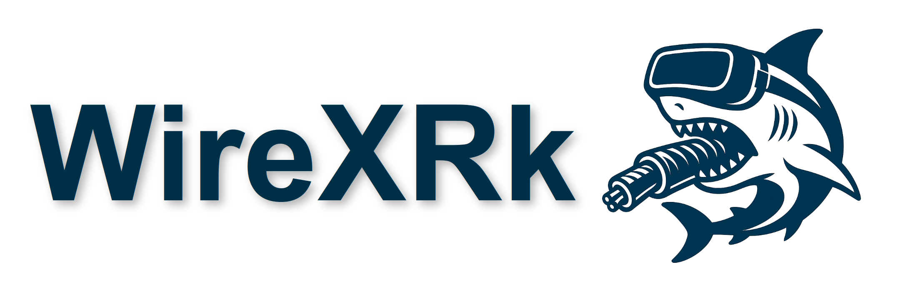
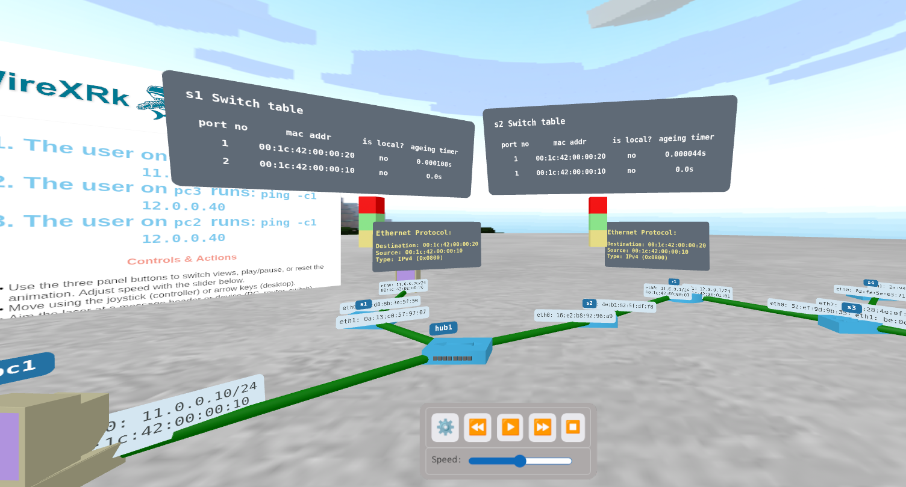

# **WireXRk**


WireXRk is a free/libre 3D visualization tool that automatically
generates interactive 3D representations of network packets captured
in real or emulated TCP/IP environments. It processes packets from all
collision domains within a TCP/IP network to create dynamic 3D
animations. These animations can be experienced using the web browser
of Extended Reality (XR) headsets such as the Meta Quest 3, or viewed
directly in Firefox on desktop and mobile devices.


In the generated animations, network packets are visually represented
as they travel from their source host through a series of Layer 2 and
Layer 3 switches. They either reach their destination or vanish at an
intermediate node or link. Users can interact with nodes and packets
by clicking with the mouse in the desktop or with the trigger of the
controller when using XR headsets.

WireXRk creates these animations automatically using header
information extracted from the captured packets. WireXRk is built
using [A-Frame](https://aframe.io/), a web framework that enables the
creation of 3D and XR experiences directly in the browser.


WireXRk can process PCAPng traces captured in any TCP/IP Network
Experimentation Environment (NEE). In our setup, we use the free/libre
NetGUI/Kathará NEE to generate
animations. [NetGUI/Kathará](https://gitlab.com/eva.castro/netgui-kathara)
offers a graphical interface for designing and managing network
topologies using the [Kathará container-based network emulation
system](https://www.kathara.org/). It also automates the creation of
the files required by WireXRk to produce the animations.

# ***Demos*** 
You can view several [animations generated with
WireXRk](https://pheras.gitlab.io/wirexrk). **Requires Firefox browser
on desktop or web browser of a XR headset such as Meta Oculus**.

[](https://pheras.gitlab.io/wirexrk)


# ***Instructions for generating a WireXRk animation***

WireXRk is a web application. To install it just clone this
repository:

```
    git clone https://gitlab.com/pheras/wirexrk
    cd wirexrk
```

1. In your Network Experimentation Environment you have to generate two
files:

    -  <code>merged_capture.json</code>: the captured traffic in all the
collision domains of the network, merged and saved as JSON.

    - <code>machineNames.json</code>: the network topology.

       It is easy to automatically generate these two files using the
       NetGUI/Kathará Network Experimentation Environment. Check out
       the examples in the [Netgui-Kathará
       laboratories](https://gitlab.com/eva.castro/netgui-kathara#netgui-kathará-laboratories).


2. Create a new directory (i.e. <code>new-demo</code>) under the
<code>demos</code> directory, and copy there both files. The rest of files
created in the following steps must be copied into the <code>new-demo</code>
directory.

1. Manually create in the <code>new-demo</code> directory the file
<code>viewsMenu.json</code>. This file is used to customize the nodes
and packets shown. See examples in <code>demos/traceroute</code> ,
<code>demos/tcp</code> , <code>demos/tcp-e2e</code> ,
<code>demos/dns</code> and <code>demos/dns-e2e</code>


4. Manually create in the <code>new-demo</code> directory the file
<code>consoles.json</code>. This file contains animations shown in
consoles. See examples in <code>demos/ping, demos/traceroute,
demos/tcp</code>.

5. Manually create in the <code>new-demo</code> directory the file
<code>infoPanel.html</code> with information and instructions that
will be shown in the informative panel of the animation. See examples
subdirectories of <code>demos</code>.

6. Create in the <code>new-demo</code> directory 2 symbolic links:

    ```
    cd new-demo
    ln -s ../../index-template.html ./index.html
    ln -s ../network-entities.html .
    ```

7. Finally, to run WireXRk you just serve the root directory from a
web server and load it from a Firefox web browser or from the browser
of XR headsets such as Meta Quest:

    ```
    cd wirexrk
    python3 -m http.server
    ```

    Now load the webpage of your new animation:
    <code>http://localhost:8000/demos/new-demo</code>.


# ***Teaching experiencies***

WireXRk animations generated with NetGUI/Kathará have been used in
several undergraduate courses on computer networking at the [Escuela
de Ingeniería de Fuenlabrada](https://www.urjc.es/eif), Universidad
Rey Juan Carlos.

## References
[Enhancing TCP/IP Architecture Learning through Virtual Reality
Technology](https://ieeexplore.ieee.org/document/11016511). Eva
M. Castro Barbero, Pedro de las Heras Quirós, Jesús M. González
Barahona, José Centeno González, Gregorio Robles Martínez. IEEE Global
Engineering Education Conference - EDUCON 25, London, 22-25th April.

**Abstract:**

> Understanding the TCP/IP architecture in introductory Computer Networks courses presents challenges for undergraduate students due to the abstract nature of concepts such as protocols, layers, services, and encapsulation. While 2D and 3D multimedia animations have been employed to support learning, the educational impact of Virtual Reality (VR)
> animations remains underexplored. To address this gap, we developed WireXRk, a 3D visualization tool that automatically generates interactive animations of network packets captured from real TCP/IP networks. These animations are accessible via VR Head-Mounted Displays (HMDs) or standard web browsers on desktop computers.
> In a study involving 134 freshmen and sophomores across four Computer Networks engineering courses, students were divided into three groups that utilized either traditional slides, 3D animations on a web browser, or 3D animations with VR HMDs. Among students with higher admission grades, learning
> outcomes were similar across all groups. However, for students with lower admission grades, significant differences emerged: those using traditional slides or 3D animations with VR HMDs performed better than those using 3D animations on a desktop.
> This suggests that students with less academic experience may benefit from more dynamic learning environments, reinforcing the need for future pedagogical approaches that integrate VR headsets to enhance engagement and retention.

# Contact Information

**Pedro de las Heras Quirós**

[Escuela de Ingeniería de Fuenlabrada](https://www.urjc.es/eif),
Universidad Rey Juan Carlos

#### We are open to your suggestions or contributions. Read file [CONTRIBUTING.md](CONTRIBUTING.md).
